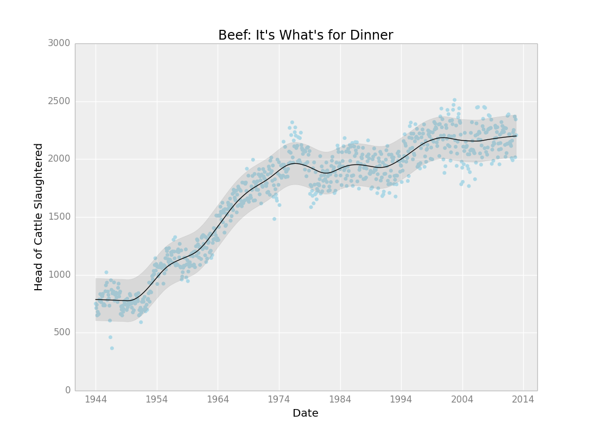

# {ggplot} from [Yhat](http://yhathq.com)
read more on our [blog](http://blog.yhathq.com/posts/ggplot-for-python.html)
```
from ggplot import *

ggplot(aes(x='date', y='beef'), data=meat) + \
    geom_point(color='lightblue') + \
    geom_line(alpha=0.25) + \
    stat_smooth(span=.05, color='black') + \
    ggtitle("Beef: It's What's for Dinner") + \
    xlab("Date") + \
    ylab("Head of Cattle Slaughtered")
```


### What is it?
Yes, it's another port of [`ggplot2`](https://github.com/hadley/ggplot2). One of the biggest reasons why I continue to reach for `R` instead of `Python` for data analysis is the lack of an easy to use, high level plotting package like `ggplot2`. I've tried other libraries like [`bokeh`](https://github.com/continuumio/bokeh) and [`d3py`](https://github.com/mikedewar/d3py) but what I really want is `ggplot2`.

`ggplot` is just that. It's an extremely un-pythonic package for doing exactly what `ggplot2` does. The goal of the package is to mimic the `ggplot2` API. This makes it super easy for people coming over from `R` to use, and prevents you from having to re-learn how to plot stuff.

### Goals
- same API as `ggplot2` for `R`
- never use matplotlib again
- ability to use both American and British English spellings of aesthetics
- tight integration with [`pandas`](https://github.com/pydata/pandas)
- pip installable

### Getting Started
#### Dependencies
I realize that these are not fun to install. My best luck has always been using `brew` if you're on a Mac
or just using [the binaries](http://www.lfd.uci.edu/~gohlke/pythonlibs/) if you're on Windows. If you're using Linux then this should be relatively
painless. You should be able to `apt-get` or `yum` all of these.
- `matplotlib`
- `pandas`
- `numpy`
- `scipy`
- `statsmodels`
- `mpltools`

#### Installation
Ok the hard part is over. Installing `ggplot` is really easy. Just use `pip`! 

    # ggplot style for matplotlib
    $ pip install mpltools
    # install ggplot using pip
    $ pip install ggplot

#### Loading `ggplot`

    # run an IPython shell (or don't)
    $ ipython
    In [1]: from ggplot import *
    In [2]: from mpltools import style
            style.use('ggplot')
            
That's it! You're ready to go!

### Examples

See [this IPython notebook](http://nbviewer.ipython.org/urls/raw.github.com/yoavram/ipython-notebooks/master/ggplot%20test%20run.ipynb).


### TODO
The list is long, but distinguished.[TODO](https://github.com/yhat/ggplot/blob/master/TODO.md)
