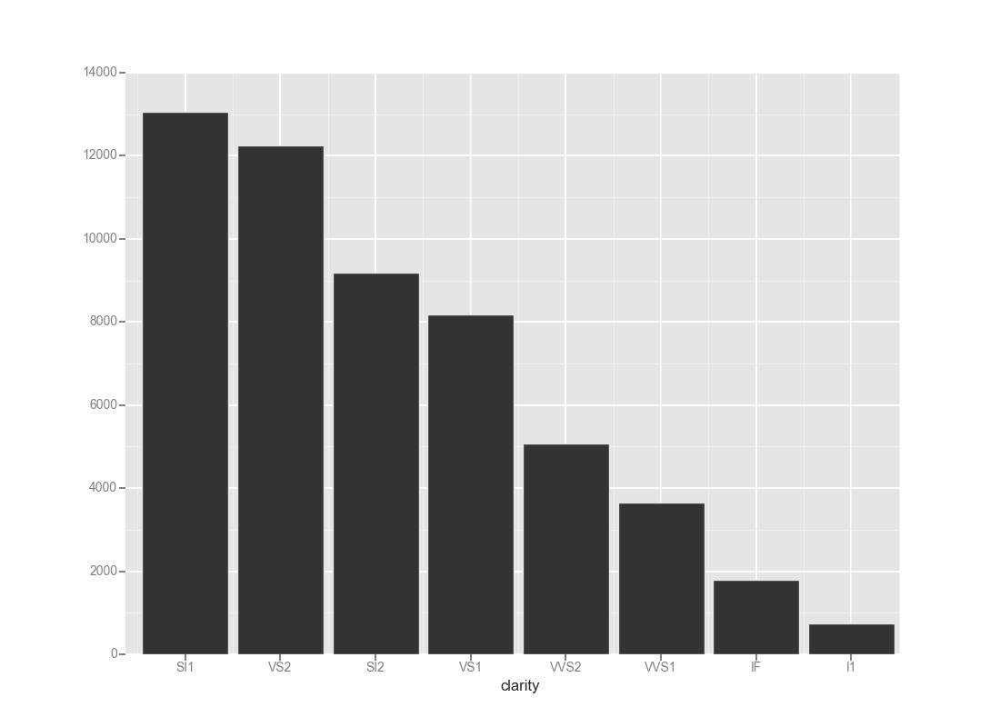
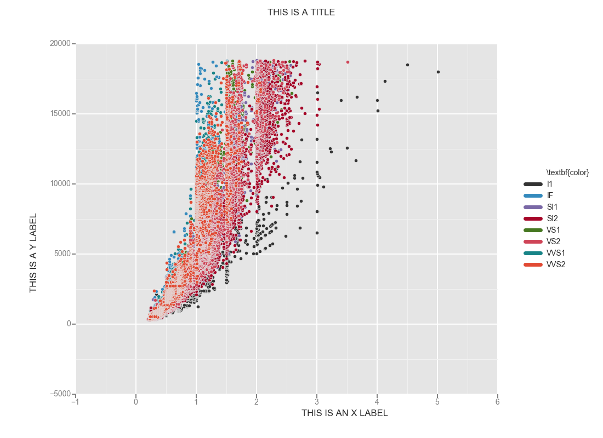

# ggplot




### What is it?
`ggplot` is a Python implementation of the grammar of graphics. It is not intended
to be a feature-for-feature port of [`ggplot2 for R`](https://github.com/hadley/ggplot2)--though 
there is much greatness in `ggplot2`, the Python world could stand to benefit 
from it. So there __will be feature overlap__, but not neccessarily mimicry 
(after all, R is a little weird).

You can do cool things like this:

```python
ggplot(diamonds, aes(x='price', color='clarity')) + \
    geom_density() + \
    scale_color_brewer(type='div', palette=7) + \
    facet_wrap('cut')
```


### Installation
```bash
$ pip install -U ggplot
# or
pip install pip install git+https://github.com/yhat/ggplot.git
```

*Note: Conda users...just use pip*  

### Examples
Examples are the best way to learn. There is a Jupyter Notebook full of them. 
There are also notebooks that show how to do particular things with ggplot 
(i.e. [make a scatter plot](./docs/how-to/Making%20a%20Scatter%20Plot.ipynb) or [make a histogram](./docs/how-to/Making%20a%20Scatter%20Plot.ipynb)).

- [docs](./docs)
- [gallery](./docs/Gallery.ipynb)
- [various examples](./examples.md)


### What happened to the old version that didn't work?
It's gone--the windows, the doors, [everything](https://www.youtube.com/watch?v=YuxCKv_0GZc). 
Just kidding, [you can find it here](https://github.com/yhat/ggplot/tree/v0.6.6), though I'm not sure why you'd want to look at it. The data grouping and manipulation bits were re-written
(so they actually worked) with things like facets in mind.

### Contributing
See *[contributing.md](./contributing.md)*.
