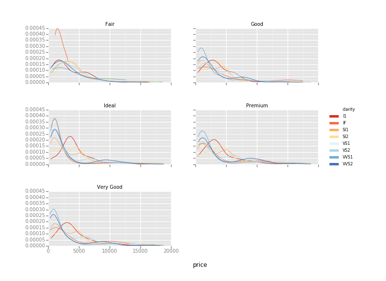

ggplot
======

What is it?
~~~~~~~~~~~

``ggplot`` is the Python version of the grammar of graphics. It is not
intended to be a feature-for-feature port of
```ggplot2 for R`` <https://github.com/hadley/ggplot2>`__. There is much
greatness in ``ggplot2``, the Python world could stand to benefit from
it.

You can do cool things like this:

.. code:: python

    ggplot(diamonds, aes(x='price', color='clarity')) + \
        geom_density() + \
        scale_color_brewer(type='div', palette=7) + \
        facet_wrap('cut')



Installation
~~~~~~~~~~~~

.. code:: bash

    $ pip install -U ggplot
    # or
    $ conda install ggplot
    # or
    pip install pip install git+https://github.com/yhat/ggplot.git

Examples
~~~~~~~~

-  `gallery <./docs/Gallery.ipynb>`__
-  `various examples <./examples.md>`__

What happened to the old version that didn't work?
~~~~~~~~~~~~~~~~~~~~~~~~~~~~~~~~~~~~~~~~~~~~~~~~~~

It's gone--the windows, the doors,
`everything <https://www.youtube.com/watch?v=YuxCKv_0GZc>`__. I deleted
most of the code and only kept what worked. The data grouping and
manipulation bits were re-written (so they actually worked) with things
like facets in mind.

Where did ``stat_identity`` and ``geom_raster`` go?
~~~~~~~~~~~~~~~~~~~~~~~~~~~~~~~~~~~~~~~~~~~~~~~~~~~

They're gone. They didn't even come close to working (also what does
``stat_identity`` even do) so they're gone.
